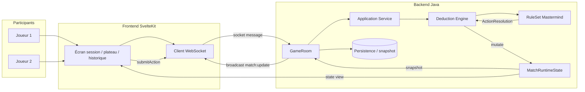

# Architecture cible v2

## 1. Vue d'ensemble

L'architecture cible de Mastermind Arena vise une séparation nette entre :

- le front SvelteKit, responsable de l'expérience utilisateur et du rendu temps réel ;
- le backend Java, responsable du moteur de jeu, des règles et de la cohérence du match ;
- la couche WebSocket, responsable de la synchronisation instantanée entre les joueurs ;
- le modèle de runtime `MatchRuntimeState`, qui représente l'état de la partie en mémoire et est la source de vérité du tour courant ;
- le `GameRoom`, qui orchestre les participants, les événements et les transitions de match.

L'objectif est d'avoir une architecture simple, observable et extensible, sans coupler la logique métier générique au Front. Le moteur de déduction est agnostique du jeu, tandis que le `RuleSet` spécifique Mastermind reste responsable de la sémantique métier.

---

## 2. Frontend SvelteKit

Le front est une application SvelteKit qui prend en charge :

- la création et la jointure de parties ;
- la session du joueur ;
- l'affichage du plateau et des pions d'indice ;
- la soumission d'une proposition ou d'une action ;
- la synchronisation temps réel via WebSocket ;
- l'affichage du statut du tour, des joueurs, des secrets visibles et de l'historique.

### Responsabilités du front

- Affichage des écrans : lobby, session, partie, historique, réglages.
- Gestion locale de l'état UI : sélection de symboles, validation de saisie, affichage des erreurs.
- Connexion WebSocket au backend pour recevoir les événements de match.
- Requête de l'état initial du match et rafraîchissement à partir des messages serveur.

### Contraintes

- Le front ne décide pas des règles de jeu.
- Le front n'applique pas les transitions du moteur.
- Le front ne manipule que ce que le backend expose dans le `MatchRuntimeState` et les événements de diffusion.

---

## 3. Backend Java

Le backend Java est centré sur une application serveur Java modulaire, avec un cœur de moteur de logique et des modules de transport / orchestration.

### Composants cibles

- `deduction-domain` : modèle métier pur et abstrait.
- `deduction-engine` : moteur générique de Match / Turn / directives / état.
- `deduction-application` : cas d'usage applicatifs (CreateMatch, JoinMatch, SubmitAction, GetMatchState, etc.).
- `deduction-websocket` : gestion des sessions, canaux temps réel et diffusion d'événements.
- `deduction-persistence` : persistance du match et des événements / snapshots.
- `deduction-server` : assemblage Spring Boot / démarrage serveur.

### Rôle du backend

- Valider les actions côté serveur.
- Appliquer les règles métier via un `RuleSet` spécifique.
- Produire une transition structurée de type `ActionResolution`.
- Mettre à jour le `MatchRuntimeState`.
- Diffuser un snapshot ou un événement de changement aux clients connectés.

---

## 4. WebSocket

Le WebSocket est la couche de synchronisation temps réel entre le serveur et les clients.

### Objectif

- informer immédiatement les joueurs quand un tour est validé ;
- distribuer les changements d'état du plateau ;
- notifier la fin de match ou les changements de rôle ;
- permettre au front de refléter l'état du jeu sans polling lourd.

### Modèle de diffusion

- un client rejoint une room de match ;
- le serveur identifie sa session et son `playerId` ;
- le serveur publie les événements sur le canal du match ;
- les clients reçoivent un message de type `match:update` ou équivalent ;
- le front reconstruit l'UI à partir de ce payload.

### Règle de conception

Le WebSocket ne remplace pas l'état du match ; il le diffuse. La vérité reste dans le backend sous forme de `MatchRuntimeState`.

---

## 5. MatchRuntimeState

`MatchRuntimeState` est le modèle runtime de référence du match. Il représente l'état du match tel que le backend l'a validé et tel que les joueurs le voient à travers les événements diffusés.

### Responsabilités

- conserver le statut global de la partie ;
- exposer les participants, l'ordre des acteurs et le tour actuel ;
- enregistrer le `turnNumber`, le `currentActorIndex` et l'état du match ;
- contenir les actions déjà jouées et l'historique des événements ;
- sécuriser les données sensibles selon l'autorisation du joueur courant ;
- fournir un snapshot cohérent pour la vue publique ou privée.

### Exemples de champs

- `matchId`
- `status` (created, active, finished, cancelled)
- `turnNumber`
- `currentActorIndex`
- `actorOrder`
- `players`
- `actionLog`
- `visibleSecretCode` ou données exposées selon le contexte
- `matchOutcomeStatus` / `matchOutcomeReason`
- `version` pour la concurrence et l'idempotence

### Invariants

- la mutation du `MatchRuntimeState` passe toujours par le moteur et le `GameRoom` ;
- un match terminé n'accepte plus de nouvelles actions ;
- les versions de state doivent être cohérentes entre la persistance et la diffusion ;
- la vue exposée au client masque les informations non autorisées.

---

## 6. GameRoom

`GameRoom` est le composant de coordination dans le backend. Il agit comme le point d'entrée du match en temps réel.

### Responsabilités de `GameRoom`

- gérer l'inscription des joueurs à la room ;
- répartir les sessions WebSocket par `matchId` ;
- recevoir les actions envoyées depuis le client ;
- déléguer la validation au service applicatif ou au moteur ;
- mettre à jour le `MatchRuntimeState` ;
- diffuser le nouvel état à tous les participants ;
- gérer les cas de rejet, d'annulation, de fin de match ou d'erreur de version.

### Relation avec le moteur

`GameRoom` ne calcule pas l'état directement. Il orchestre :

1. la réception d'une action ;
2. la validation structurelle ;
3. la résolution de règles ;
4. la mise à jour du `MatchRuntimeState` ;
5. la diffusion des changements.

---

## 7. Flux d'un tour

Le flux d'un tour suit un cycle cohérent, du client au backend puis retour au client.

### Étape 1 — Le joueur agit depuis le front

Le client SvelteKit construit une action de jeu, par exemple une proposition, une validation d'indice ou une action de fin de tour.

### Étape 2 — Envoi WebSocket ou requête applicative

Selon la couche de transport retenue, l'action est transmise au backend par WebSocket ou par un endpoint applicatif. Le message contient au minimum :

- `matchId`
- `playerId`
- `turnNumber` ou version attendue
- `idempotencyKey`
- payload métier

### Étape 3 — Validation et résolution

Le `GameRoom` reçoit l'action et la transmet au service applicatif / moteur. Le moteur applique les règles métier du jeu via le `RuleSet`.

Le résultat est une `ActionResolution` structurée comprenant :

- directives moteur (`ACCEPT_ACTION`, `END_TURN`, `FINISH_MATCH`, etc.) ;
- `EvaluationResult` opaque ;
- événements métier ;
- `MatchOutcome` si la partie est terminée.

### Étape 4 — Mise à jour du `MatchRuntimeState`

Le backend met à jour le `MatchRuntimeState` en fonction des directives acceptées. Les invariants de cohérence sont respectés :

- tour toujours avancé correctement ;
- action idempotente ;
- pas d'écriture concurrente non autorisée ;
- match terminal non réentrant.

### Étape 5 — Diffusion au client

Le `GameRoom` publie le snapshot ou l'événement de match sur le canal WebSocket. Le front reçoit le message et met à jour :

- le plateau ;
- les indices ;
- la vue du tour courant ;
- l'historique d'actions ;
- les états d'interface (tour actif, attente d'indices, match terminé).

### Étape 6 — Nouveau tour ou fin de match

Selon la directive reçue :

- le tour continue ;
- le rôle actif change ;
- le match passe en `finished` avec `MatchOutcome` ;
- ou le match est annulé avec une `CancellationReason`.

---

## 8. Diagramme de structure

---

## 9. Principe architectural central

La cible repose sur un principe simple :

> le moteur garantit la cohérence du match, mais le gameplay métier reste exprimé par le `RuleSet` et l'état runtime est centralisé dans le `MatchRuntimeState`.

Cela permet d'industrialiser le développement sans verrouiller le backend sur un seul jeu. L'architecture reste compatible avec l'évolution vers d'autres jeux de déduction, tout en gardant un Mastermind Arena fonctionnel, observable et cohérent.
